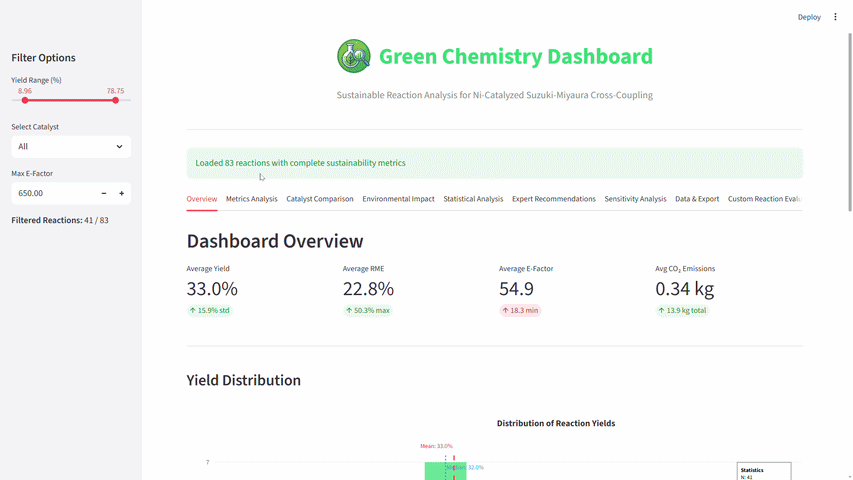
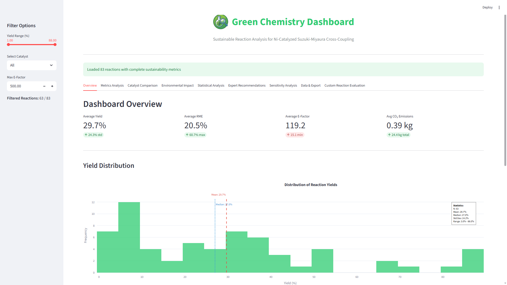
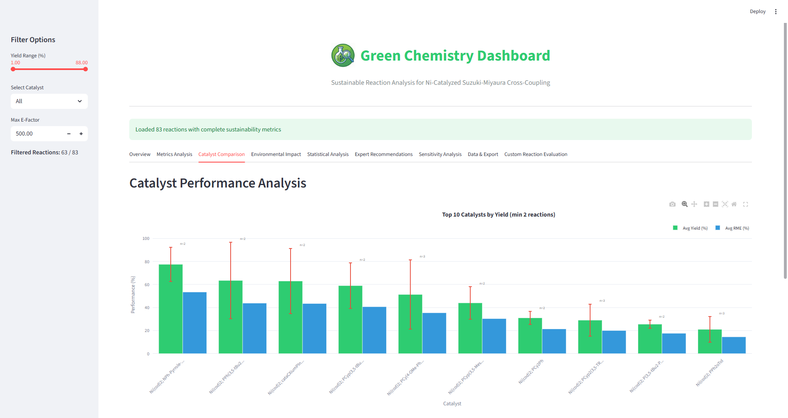
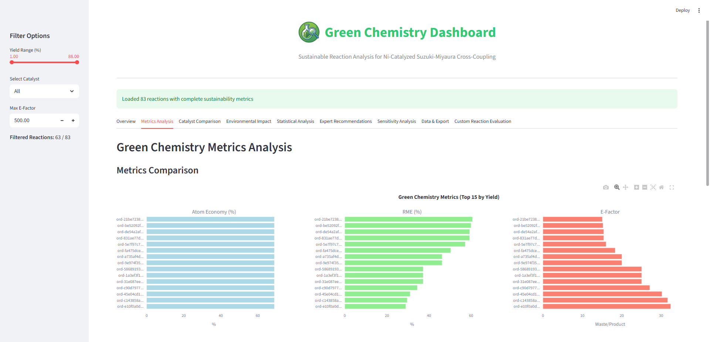
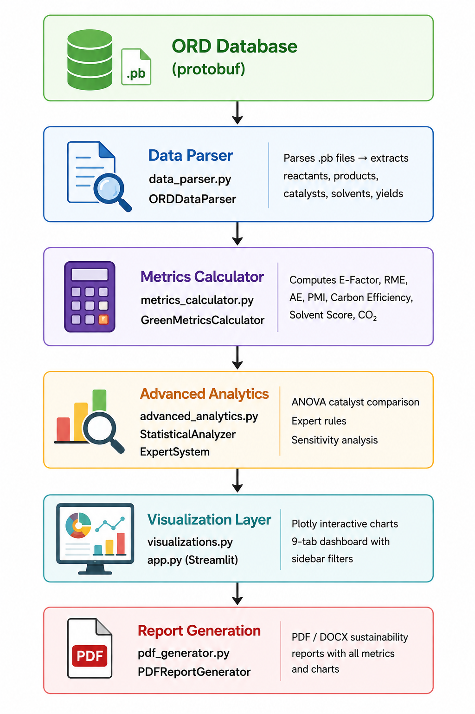

<div align="center">

# 🌿 Green Chemistry Dashboard

### Suzuki-Miyaura Cross-Coupling Reaction Analysis

[](https://python.org)
[](https://streamlit.io)
[](https://open-reaction-database.org/dataset/ord_dataset-3b5db90e337942ea886b8f5bc5e3aa72)

> **An interactive sustainability analytics platform for evaluating Suzuki-Miyaura cross-coupling reactions from the Open Reaction Database. Computing green chemistry metrics, environmental impact and catalyst performance with Rule based Intelligence powered recommendations.**

[🔗 Dataset](https://open-reaction-database.org/dataset/ord_dataset-3b5db90e337942ea886b8f5bc5e3aa72) · [📄 Research Paper](https://doi.org/10.22214/ijraset.2026.82772) · [📊 Dashboard](#-dashboard-tabs)

</div>

---

## 🎬 Demo



---

## 📸 Screenshots

### Dashboard Overview


### Catalyst Performance Analysis


### Green Chemistry Metrics


---

## 📌 What This Project Does

Suzuki-Miyaura cross-coupling is one of the most widely used reactions in pharmaceutical and fine chemical synthesis. However, evaluating its **sustainability**: waste generated, atom efficiency, carbon footprint which requires complex multi-metric analysis.

This dashboard pulls reaction data directly from the **Open Reaction Database (ORD)** and computes seven green chemistry metrics per reaction, enabling chemists to:

- Compare catalysts by yield, E-Factor and environmental impact
- Identify the greenest reaction conditions statistically
- Get Rule based intelligence expert system recommendations for sustainable synthesis
- Export full sustainability reports as CSV, PDF or DOCX

---

## 🔑 Key Findings

- Analyzed Suzuki-Miyaura cross-coupling reactions from ORD dataset `ord_dataset-3b5db90e337942ea886b8f5bc5e3aa72`
- Computed 7 green chemistry sustainability metrics per reaction
- Identified top-performing catalyst systems by statistical comparison
- Generated automated expert system recommendations for greener synthesis conditions
- Produced downloadable CSV, PDF and DOCX sustainability reports with full metric breakdowns

---

## 🔬 Research Contribution

This project contributes:

- Automated green chemistry evaluation pipeline built on the ORD protobuf schema
- Catalyst comparison methodology using ANOVA with pairwise confidence intervals and others
- Expert system that learns synthesis rules from reaction data and recommends optimal conditions
- Sensitivity analysis identifying which reaction parameters most influence yield and sustainability
- One-click CSV, PDF and DOCX report generation for academic and industrial use

---

## 📄 Research Paper

This work is published in a peer-reviewed journal. If you use this project in your research please cite:

> **Manoj H N and Hemanth Kumar**, *"A Streamlit Based Dashboard for Green Chemistry Reaction Analysis"*, International Journal for Research in Applied Science & Engineering Technology (IJRASET), 2026.
> DOI: [10.22214/ijraset.2026.82772](https://doi.org/10.22214/ijraset.2026.82772)

---

## 📊 Dashboard Tabs

| # | Tab | What It Shows |
|---|---|---|
| 1 | **Dashboard Overview** | Average yield, RME, E-Factor, CO₂ — key KPIs at a glance |
| 2 | **Green Chemistry Metrics** | Metrics comparison charts + correlation heatmap |
| 3 | **Catalyst Performance** | Side-by-side catalyst statistics and ranking |
| 4 | **Environmental Impact** | CO₂ emissions distribution + E-Factor analysis |
| 5 | **Advanced Statistics** | ANOVA + pairwise comparisons + confidence intervals |
| 6 | **Expert System** | recommendations + learned synthesis rules |
| 7 | **Sensitivity Analysis** | Factor impact on yield — which variables matter most |
| 8 | **Data & Export** | Full filtered data table + PDF/DOCX report download |
| 9 | **Custom Reaction Evaluation** | Enter your own reaction conditions and get instant metrics |

---

## 🧪 Green Chemistry Metrics Computed

| Metric | Meaning |
|---|---|
| **E-Factor** | Lower = greener. Industry gold standard |
| **RME** | Reaction Mass Efficiency — overall efficiency |
| **Atom Economy (AE)** | % atoms that end up in product |
| **PMI** | Process Mass Intensity — total material used |
| **Carbon Efficiency** | % carbon atoms incorporated into product |
| **Solvent Score (1–10 scale)** | Greenness of solvent choice |
| **CO₂ Footprint** | Estimated kg CO₂ per reaction |

---

## 🗂️ Project Structure

```
ord-green-chemistry-dashboard/
│
├── app.py                    # Main Streamlit application — 9-tab dashboard
├── data_parser.py            # ORD protobuf parser → pandas DataFrame
├── metrics_calculator.py     # 7 green chemistry metric computations
├── visualizations.py         # Plotly charts — yield, heatmap, scatter, bar
├── advanced_analytics.py     # ANOVA, expert system, sensitivity analysis
├── pdf_generator.py          # PDF and DOCX report generator (ReportLab)
├── requirements.txt          # All dependencies pinned
├── image/                 
│   └── icon.png
├── data/                 
│   └── ord_search_results.pb    #insert your download files here
└── README.md                 # This file
```

---

## ⚙️ How It Works


---

## 🚀 Quick Start

### 1. Clone the repository
```bash
git clone https://github.com/Manoj8541/ord-green-chemistry-dashboard.git
cd ord-green-chemistry-dashboard
```

### 2. Install dependencies
```bash
pip install -r requirements.txt
```

### 3. Add the ORD dataset
Download the dataset protobuf file from:
```
https://open-reaction-database.org/dataset/ord_dataset-3b5db90e337942ea886b8f5bc5e3aa72
```
Place it at:
```
data/ord_search_results.pb
```

### 4. Run the app
```bash
streamlit run app.py
```

The dashboard opens at `http://localhost:8501`

---

## 🔬 Dataset

| Field | Details |
|---|---|
| **Source** | Open Reaction Database (ORD) |
| **Dataset ID** | `ord_dataset-3b5db90e337942ea886b8f5bc5e3aa72` |
| **Reaction Type** | Ni-Catalyzed Suzuki-Miyaura Cross-Coupling |
| **Link** | [View on ORD](https://open-reaction-database.org/dataset/ord_dataset-3b5db90e337942ea886b8f5bc5e3aa72) |

---

## 🛠️ Tech Stack

| Category | Tools |
|---|---|
| Web Framework | Streamlit 1.52.1 |
| Chemistry | ord-schema 0.3.99 |
| Data | Pandas, NumPy |
| Visualisation | Plotly 6.5.0 |
| Statistics | SciPy |
| Report Generation | ReportLab (PDF), Pandas (Excel), Python-docx (document) |

---

<div align="center">
<i>Built with Streamlit · Open Reaction Database</i>
</div>
